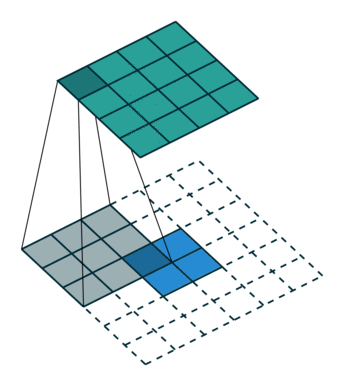

# Segmentation of neural structures in EM images, using tensorflow 2.0

## Author : Sarang Zambare

Tensorflow 2.0 is here, session is gone. This repository uses tensorflow 2.0 to train a convolutional segmentation model, consisting of downsampling and upsampling layers.

Input image             |  Segmented image, animated over epochs.
:-------------------------:|:-------------------------:
  |  

*Semantic segmentation is the process of assigning each pixel in a given image a class, to get a better understanding of the image or for further processing.*

## The problem
This task is a part of the [ISBI 2012 2D segmentation challenge](http://brainiac2.mit.edu/isbi_challenge/home). We deal with a set of 30 consecutive images (512 × 512 pixels) from a serial section Transmission Electron Microscopy (ssTEM) dataset of the Drosophila first instar larva ventral nerve cord ([VNC; Cardona et al., 2010](https://www.frontiersin.org/articles/10.3389/fnana.2015.00142/full#B6)). **The aim is to assign each pixel to either a "0" for belonging to the boundary between neurons, or "1" for belonging to the inside of the cell, resulting into a binary image with "black" for cell boundaries and "white" for other areas.**

Boundary detection is challenging because many boundaries look fuzzy and ambiguous. Furthermore, only boundaries between neurites should be detected, and those of intracellular organelles like mitochondria and synaptic vesicles should be ignored.  

## Approach :

The idea is to have a neural network architecture consisting of:
1. Downsampling layers: which would be responsible for feature extraction from the image. These layers are the conventional convolutional layers, along with maxpooling layers to downsample the image. Think of this as projecting the image into a lower dimensional space.
2. Upsampling layers : These layers transform their inputs into higher dimensional representations. A way to do this for images is using transposed convolution, which can be thought of as a reversed way of doing the convolution operation (well not exactly). The difference between normal convolution and transposed convolution can be understood well by the gifs below by [Vincent Dumoulin, Francesco Visin](https://github.com/vdumoulin/conv_arithmetic) :


## Convolution animations
*Blue maps are inputs, and cyan maps are outputs*
<table style="width:100%; table-layout:fixed;">
  <tr>
    <td></td>
    <td></td>
    <td></td>
  </tr>
  <tr>
    <td>No padding, no strides</td>
    <td>Arbitrary padding, no strides</td>
    <td>Padding, strides</td>
  </tr>
</table>

## Transposed convolution animations (Upsampling)
*Blue maps are inputs, and cyan maps are outputs*
<table style="width:100%; table-layout:fixed;">
  <tr>
    <td></td>
    <td></td>
    <td></td>
  </tr>
  <tr>
    <td>No padding, no strides, transposed</td>
    <td>Arbitrary padding, no strides, transposed</td>
    <td>Padding, strides, transposed</td>
  </tr>
</table>

The base idea here is to design a dnn, which encodes the features using downsampling layers, and then generates segmented images using upsampling layers.

This is a supervised process, and for each input image, the label is a grayscale image consisting of black cell boundaries and white interiors of the cell.


## Model :

Along with a series of downsampling and upsampling layers, the model also has skip connections. **Skip connections** are connections between activations of two layers which are not consecutive. Such cross layer links helps in cases where it might be necessary to "remember" extracted features at each level, in order to recompose the image from a lower dimensional space. These connections are in no way restrictive, because the weightage that's given to such connections is learned, and should the architecture require no such connections, then the weights would simply be learned to be zero.

Below is the summary of the model used :

```
def segmentator_model(input_shape):

    x_inputs = Input(input_shape)
    x = Conv2D(64, 3, activation = 'relu', padding = 'same', kernel_initializer = 'he_normal')(x_inputs)
    x = Conv2D(64, 3, activation = 'relu', padding = 'same', kernel_initializer = 'he_normal')(x)
    x_skip_4 = x

    x = MaxPooling2D(pool_size=(2, 2))(x)
    x = Conv2D(128, 3, activation = 'relu', padding = 'same', kernel_initializer = 'he_normal')(x)
    x = Conv2D(128, 3, activation = 'relu', padding = 'same', kernel_initializer = 'he_normal')(x)
    x_skip_3 = x

    x = MaxPooling2D(pool_size=(2, 2))(x)
    x = Conv2D(256, 3, activation = 'relu', padding = 'same', kernel_initializer = 'he_normal')(x)
    x = Conv2D(256, 3, activation = 'relu', padding = 'same', kernel_initializer = 'he_normal')(x)
    x_skip_2 = x

    x = MaxPooling2D(pool_size=(2, 2))(x)
    x = Conv2D(512, 3, activation = 'relu', padding = 'same', kernel_initializer = 'he_normal')(x)
    x = Conv2D(512, 3, activation = 'relu', padding = 'same', kernel_initializer = 'he_normal')(x)
    x = Dropout(0.5)(x)
    x_skip_1 = x

    x = MaxPooling2D(pool_size=(2, 2))(x)
    x = Conv2D(1024, 3, activation = 'relu', padding = 'same', kernel_initializer = 'he_normal')(x)
    x = Conv2D(1024, 3, activation = 'relu', padding = 'same', kernel_initializer = 'he_normal')(x)
    x = Dropout(0.5)(x)

    x = Conv2DTranspose(filters=512,kernel_size=2,activation='relu',padding='same',strides=2,kernel_initializer='he_normal')(x)
    x = concatenate([x_skip_1,x], axis = 3)
    x = Conv2D(512, 2, activation = 'relu', padding = 'same', kernel_initializer = 'he_normal')(x)
    x = Conv2D(512, 2, activation = 'relu', padding = 'same', kernel_initializer = 'he_normal')(x)

    x = Conv2DTranspose(filters=256,kernel_size=2,activation='relu',padding='same',strides=2,kernel_initializer='he_normal')(x)
    x = concatenate([x_skip_2,x], axis = 3)
    x = Conv2D(256, 2, activation = 'relu', padding = 'same', kernel_initializer = 'he_normal')(x)
    x = Conv2D(256, 2, activation = 'relu', padding = 'same', kernel_initializer = 'he_normal')(x)

    x = Conv2DTranspose(filters=256,kernel_size=2,activation='relu',padding='same',strides=2,kernel_initializer='he_normal')(x)
    x = concatenate([x_skip_3,x], axis = 3)
    x = Conv2D(128, 2, activation = 'relu', padding = 'same', kernel_initializer = 'he_normal')(x)
    x = Conv2D(128, 2, activation = 'relu', padding = 'same', kernel_initializer = 'he_normal')(x)

    x = Conv2DTranspose(filters=128,kernel_size=2,activation='relu',padding='same',strides=2,kernel_initializer='he_normal')(x)
    x = concatenate([x_skip_4,x], axis = 3)
    x = Conv2D(64, 2, activation = 'relu', padding = 'same', kernel_initializer = 'he_normal')(x)
    x = Conv2D(64, 2, activation = 'relu', padding = 'same', kernel_initializer = 'he_normal')(x)
    x = Conv2D(64, 2, activation = 'relu', padding = 'same', kernel_initializer = 'he_normal')(x)
    x = Conv2D(1, 1, activation = 'sigmoid', padding = 'same', kernel_initializer = 'he_normal')(x)


    return tf.keras.Model(inputs=x_inputs,outputs=x)
```

```
Model: "model"
__________________________________________________________________________________________________
Layer (type)                    Output Shape         Param #     Connected to                     
==================================================================================================
input_1 (InputLayer)            [(None, 256, 256, 1) 0                                            
__________________________________________________________________________________________________
conv2d (Conv2D)                 (None, 256, 256, 64) 640         input_1[0][0]                    
__________________________________________________________________________________________________
conv2d_1 (Conv2D)               (None, 256, 256, 64) 36928       conv2d[0][0]                     
__________________________________________________________________________________________________
max_pooling2d (MaxPooling2D)    (None, 128, 128, 64) 0           conv2d_1[0][0]                   
__________________________________________________________________________________________________
conv2d_2 (Conv2D)               (None, 128, 128, 128 73856       max_pooling2d[0][0]              
__________________________________________________________________________________________________
conv2d_3 (Conv2D)               (None, 128, 128, 128 147584      conv2d_2[0][0]                   
__________________________________________________________________________________________________
max_pooling2d_1 (MaxPooling2D)  (None, 64, 64, 128)  0           conv2d_3[0][0]                   
__________________________________________________________________________________________________
conv2d_4 (Conv2D)               (None, 64, 64, 256)  295168      max_pooling2d_1[0][0]            
__________________________________________________________________________________________________
conv2d_5 (Conv2D)               (None, 64, 64, 256)  590080      conv2d_4[0][0]                   
__________________________________________________________________________________________________
max_pooling2d_2 (MaxPooling2D)  (None, 32, 32, 256)  0           conv2d_5[0][0]                   
__________________________________________________________________________________________________
conv2d_6 (Conv2D)               (None, 32, 32, 512)  1180160     max_pooling2d_2[0][0]            
__________________________________________________________________________________________________
conv2d_7 (Conv2D)               (None, 32, 32, 512)  2359808     conv2d_6[0][0]                   
__________________________________________________________________________________________________
dropout (Dropout)               (None, 32, 32, 512)  0           conv2d_7[0][0]                   
__________________________________________________________________________________________________
max_pooling2d_3 (MaxPooling2D)  (None, 16, 16, 512)  0           dropout[0][0]                    
__________________________________________________________________________________________________
conv2d_8 (Conv2D)               (None, 16, 16, 1024) 4719616     max_pooling2d_3[0][0]            
__________________________________________________________________________________________________
conv2d_9 (Conv2D)               (None, 16, 16, 1024) 9438208     conv2d_8[0][0]                   
__________________________________________________________________________________________________
dropout_1 (Dropout)             (None, 16, 16, 1024) 0           conv2d_9[0][0]                   
__________________________________________________________________________________________________
conv2d_transpose (Conv2DTranspo (None, 32, 32, 512)  2097664     dropout_1[0][0]                  
__________________________________________________________________________________________________
concatenate (Concatenate)       (None, 32, 32, 1024) 0           dropout[0][0]                    
                                                                 conv2d_transpose[0][0]           
__________________________________________________________________________________________________
conv2d_10 (Conv2D)              (None, 32, 32, 512)  2097664     concatenate[0][0]                
__________________________________________________________________________________________________
conv2d_11 (Conv2D)              (None, 32, 32, 512)  1049088     conv2d_10[0][0]                  
__________________________________________________________________________________________________
conv2d_transpose_1 (Conv2DTrans (None, 64, 64, 256)  524544      conv2d_11[0][0]                  
__________________________________________________________________________________________________
concatenate_1 (Concatenate)     (None, 64, 64, 512)  0           conv2d_5[0][0]                   
                                                                 conv2d_transpose_1[0][0]         
__________________________________________________________________________________________________
conv2d_12 (Conv2D)              (None, 64, 64, 256)  524544      concatenate_1[0][0]              
__________________________________________________________________________________________________
conv2d_13 (Conv2D)              (None, 64, 64, 256)  262400      conv2d_12[0][0]                  
__________________________________________________________________________________________________
conv2d_transpose_2 (Conv2DTrans (None, 128, 128, 256 262400      conv2d_13[0][0]                  
__________________________________________________________________________________________________
concatenate_2 (Concatenate)     (None, 128, 128, 384 0           conv2d_3[0][0]                   
                                                                 conv2d_transpose_2[0][0]         
__________________________________________________________________________________________________
conv2d_14 (Conv2D)              (None, 128, 128, 128 196736      concatenate_2[0][0]              
__________________________________________________________________________________________________
conv2d_15 (Conv2D)              (None, 128, 128, 128 65664       conv2d_14[0][0]                  
__________________________________________________________________________________________________
conv2d_transpose_3 (Conv2DTrans (None, 256, 256, 128 65664       conv2d_15[0][0]                  
__________________________________________________________________________________________________
concatenate_3 (Concatenate)     (None, 256, 256, 192 0           conv2d_1[0][0]                   
                                                                 conv2d_transpose_3[0][0]         
__________________________________________________________________________________________________
conv2d_16 (Conv2D)              (None, 256, 256, 64) 49216       concatenate_3[0][0]              
__________________________________________________________________________________________________
conv2d_17 (Conv2D)              (None, 256, 256, 64) 16448       conv2d_16[0][0]                  
__________________________________________________________________________________________________
conv2d_18 (Conv2D)              (None, 256, 256, 64) 16448       conv2d_17[0][0]                  
__________________________________________________________________________________________________
conv2d_19 (Conv2D)              (None, 256, 256, 1)  65          conv2d_18[0][0]                  
==================================================================================================
Total params: 26,070,593
Trainable params: 26,070,593
Non-trainable params: 0
__________________________________________________________________________________________________

```

Note that all the "concatenate" layers are the skip connections.


## Training :

The dataset consists of only 30 training images. This is far from enough to train a deep neural network. Hence, we augment the data, using such transformations as mirroring, shearing, rotating etc. All these transformations are beautifully taken care of by keras' built function called 'ImageDataGenerator'. This function gives us a python generator object, from which we can indefinitely extract transformed images. This process is taken care of in the 'data_pre.py' module.

Before the images are fed into the network, they are resized to (256,256) to decrease the computational expense. Below is a list of parameters used for training :

* **Steps per epoch = 1000**
* **Batch size = 2 images per step**
* **Number of epochs = 10**
* **Loss : binary cross-entropy**
* **Optimizer : Adam**
* **Learning rate: 1e-4 (no decay)**

Training for 10 epochs with the above configuration took about 30 hours on a 1.4 GHz Intel Core i5 CPU.

The acheived accuracy was : **96% on training set, 92% on test set**


## Results :

Input image             |  Segmented image
:-------------------------:|:-------------------------:
  |  
  |  
  |  


For this specific problem, a host of non-machine learning approaches might give better results as well. (e.g. Edge detection algorithms).
